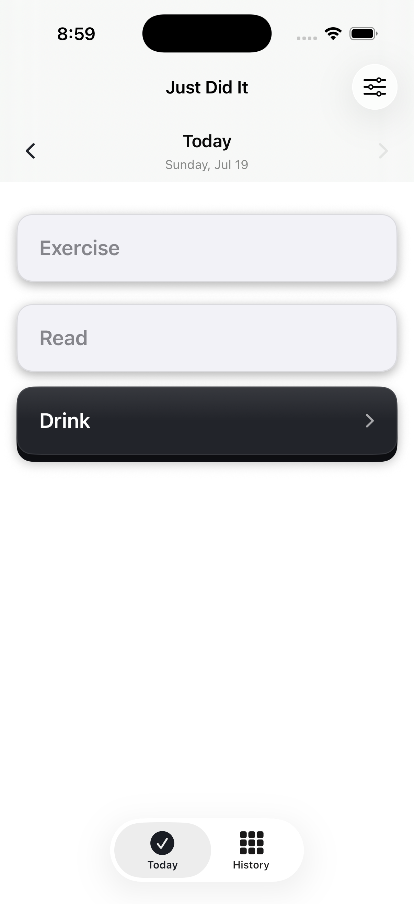
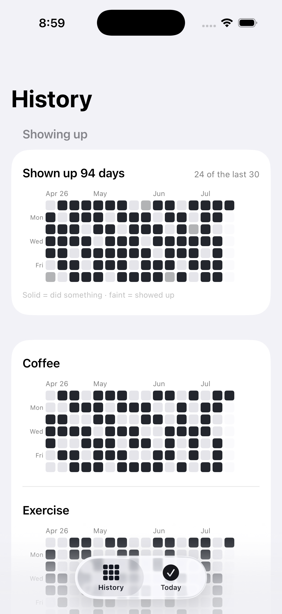

# Just Did It

> Consistency is the consistency of showing up — not the consistency of doing it perfectly.
> We don't need a perfect day. But we need to do it every day.

A yes/no daily habit checkoff app I built for myself. Tap a key when you did the thing; see your consistency as a GitHub-style grid. iOS, local-only, no accounts, no dependencies. The name is a joke on Nike's.

<p align="center">
  
  &nbsp;&nbsp;
  
</p>

## What it does

- **Yes/no checkoffs, nothing else** — an action is either done today or it isn't. No counts, no durations, no notes. Tap to check, tap to uncheck.
- **Keys, not checkboxes** — each action is a raised graphite key with a real 3D bottom lip that presses flush, with a haptic click. I wanted checking off to feel like a hardware button / fidget switch. Black/white parity in dark mode.
- **GitHub-style consistency grids** — History shows a contribution grid per action, plus an overall one at the top with a headline count of days.
- **Groups** — related actions fold into one key ("Drink" expands in place to Coffee / Tea / Alcohol).
- **A reminder that learns your open time** — one local notification a day, scheduled from the median of your recent opens minus 15 minutes. No server. Toggle in the Edit list.
- **Local data only** — SwiftData/SQLite in the app sandbox; rides along in the normal iPhone backup. Nothing leaves the device.

## Design choices

A few deliberate ones, downstream of the quote at the top:

- There's no streak counter that resets to zero. The headline is "Shown up N days" — cumulative. A missed day is a blank cell in the grid, and that's the whole consequence.
- Opening the app counts as showing up (the overall grid's faint level), so a rest day where there's nothing to log still registers. Done actions render solid.
- The reminder skips days you've already opened the app, and today recomputes at midnight and on foreground so the list never hangs on yesterday.
- Everything is monochrome. Done keys recede to flat and light; not-done keys sit raised and dark. The contrast is the UI.

## Stack

SwiftUI + SwiftData, zero dependencies. iOS 18+, Xcode 16.

## Building it onto your phone

Not on the App Store — I sideload it, and you'd do the same.

**Xcode:** open `JustDidIt.xcodeproj`, set your own team and bundle identifier under *Signing & Capabilities*, build to your device. A free Apple ID works.

**Headless** (what I actually use): once signing is configured, plug in the unlocked phone and

```sh
./deploy.sh
```

builds, installs, and launches without opening Xcode.

With a free Apple ID the signature expires after 7 days — re-run `./deploy.sh` to renew; data persists.

## License

[GPL-3.0](LICENSE).
